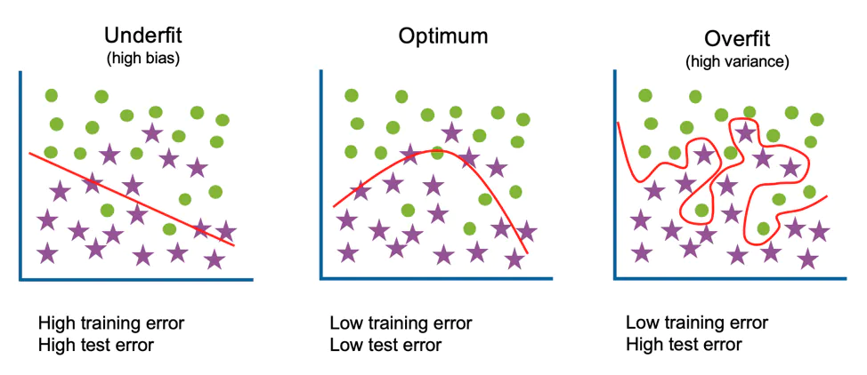

> Czym jest uczenie maszynowe (machine learning)?

Obszar sztucznej inteligencji poświęcony algorytmom, które poprawiają się automatycznie poprzez doświadczenie, czyli ekspozycję na dane. Algorytmy uczenia maszynowego budują model matematyczny na podstawie przykładowych danych, zwanych zbiorem uczącym, w celu prognozowania lub podejmowania decyzji bez bycia zaprogramowanym explicite przez człowieka do tego celu.

> Czym jest uczenie z nadzorem (supervised learning)?

Uczenie maszynowe, które zakłada obecność ludzkiego nadzoru nad tworzeniem funkcji odwzorowującej wejście systemu na jego wyjście.

Nadzór polega na stworzeniu zestawu danych uczących, czyli par:
- wejściowy obiekt uczący (np. wektor);
- pożądana przez nadzorcę (nauczyciela) odpowiedź (np. jakaś konkretna wartość liczbowa).

Zadaniem systemu jest nauczenie się przewidywania prawidłowej odpowiedzi na zadane pobudzenie oraz generalizacja przypadków wyuczonych na przypadki, z którymi system jeszcze się nie zetknął. Do modelowania procesów technicznych zwykle wykorzystuje się uczenie nadzorowane.

 **Supervised machine learning**    

Supervised learning, also known as supervised machine learning, is defined by its use of labeled datasets to train algorithms to classify data or predict outcomes accurately. As input data is fed into the model, the model adjusts its weights until it has been fitted appropriately. This occurs as part of the cross validation process to ensure that the model avoids overfitting or underfitting. Supervised learning helps organizations solve a variety of real-world problems at scale, such as classifying spam in a separate folder from your inbox. Some methods used in supervised learning include neural networks, naïve bayes, linear regression, logistic regression, random forest, and support vector machine (SVM).

**Unsupervised machine learning**

Unsupervised learning, also known as unsupervised machine learning, uses machine learning algorithms to analyze and cluster unlabeled datasets. These algorithms discover hidden patterns or data groupings without the need for human intervention. This method’s ability to discover similarities and differences in information make it ideal for exploratory data analysis, cross-selling strategies, customer segmentation, and image and pattern recognition. It’s also used to reduce the number of features in a model through the process of dimensionality reduction. Principal component analysis (PCA) and singular value decomposition (SVD) are two common approaches for this. Other algorithms used in unsupervised learning include neural networks, k-means clustering, and probabilistic clustering methods.

**Semi-supervised learning**

Semi-supervised learning offers a happy medium between supervised and unsupervised learning. During training, it uses a smaller labeled data set to guide classification and feature extraction from a larger, unlabeled data set. Semi-supervised learning can solve the problem of not having enough labeled data for a supervised learning algorithm. It also helps if it’s too costly to label enough data.

> Czym różnią się problemy regresji od klasyfikacji? Czym jest problem regresji, czym jest problem klasyfikacji?

Przykładem algorytmów, które należy zaliczyć do pierwszego zbioru, są algorytmy klasyfikacyjne. To je m.in. implementuje się w oprogramowaniu wykorzystywanym w predykcyjnym utrzymaniu ruchu i predykcyjnej kontroli jakości. Przykładami ich zastosowań w życiu codziennym są filtry antyspamowe w poczcie elektronicznej i badania zdolności kredytowej klientów banku, którzy starają się o kredyt.

Na ich podstawie można się dość łatwo domyślić sposobu, w jaki działają algorytmy klasyfikacyjne. Polega on (w bardzo dużym uproszczeniu) na tym, żeby znaleźć na postawione pytanie jednoznaczną odpowiedź poprzez wybór jednej z możliwych opcji (tak / nie albo A / B / C / D).

Do kategorii uczenia nadzorowanego należy również zaliczyć algorytmy regresyjne. O ile w tych klasyfikacyjnych poszukiwana była odpowiedź binarna (0 / 1, tak / nie), o tyle w przypadku regresyjnych prognozowana jest wartość numeryczna. Przykładem ich zastosowania w życiu codziennym jest przewidywanie wielkości sprzedaży albo wartości zysku.

> Czym różnią się hiperparametry od parametrów?

> Czym jest przeuczenie (overfitting)?

Overfitting is a concept in data science, which occurs when a statistical model fits exactly against its training data. When this happens, the algorithm unfortunately cannot perform accurately against unseen data, defeating its purpose.

When machine learning algorithms are constructed, they leverage a sample dataset to train the model. However, when the model trains for too long on sample data or when the model is too complex, it can start to learn the “noise,” or irrelevant information, within the dataset. When the model memorizes the noise and fits too closely to the training set, the model becomes “overfitted,” and it is unable to generalize well to new data.

TLDL: model uczy się danych. Jak się przeuczy to błędne dane tzn takie 'tło' traktuje jako część modelu. I przez to przestaje być obiektywne i jest problem

> Czym jest funkcja straty/celu/kosztu (loss function)?

https://towardsdatascience.com/common-loss-functions-in-machine-learning-46af0ffc4d23
 
> Po co dzieli się zbiory na treningowy, walidacyjny i testowy (train, validation, test set)?

 Training set vs validation set vs test set

Training, testing and validation are key steps in the ML workflow. For each step, we need a separate dataset. Therefore, the entree dataset is divided into the following parts.

- Training set: 

This is the largest part in terms of the size of the dataset. The training set is used to train (fit) the model. The model parameters learn their values (rules or patterns) from training data. In other words, the training set is used to fit the parameters of the model on a fixed combination of hyperparameters.

- Validation set: 

Our model training process is not a one-time process. We have to train multiple models by trying different combinations of hyperparameters. Then, we evaluate the performance of each model on the validation set. Therefore, the validation test is useful for hyperparameter tuning or selecting the best model out of different models. In some contexts, the validation set is also called the Development (Dev) set.

- Test set: 

After the tuning process, we select the best model with an optimal combination of hyperparameters. We measure the performance of that model using the test set.

--

Typically to perform supervised learning, you need two types of data sets:

In one dataset (your "gold standard"), you have the input data together with correct/expected output; This dataset is usually duly prepared either by humans or by collecting some data in a semi-automated way. But you must have the expected output for every data row here because you need this for supervised learning.

The data you are going to apply your model to. In many cases, this is the data in which you are interested in the output of your model, and thus you don't have any "expected" output here yet.

While performing machine learning, you do the following:

Training phase: you present your data from your "gold standard" and train your model, by pairing the input with the expected output.

Validation/Test phase: in order to estimate how well your model has been trained (that is dependent upon the size of your data, the value you would like to predict, input, etc) and to estimate model properties (mean error for numeric predictors, classification errors for classifiers, recall and precision for IR-models etc.)

Application phase: now, you apply your freshly-developed model to the real-world data and get the results. Since you usually don't have any reference value in this type of data (otherwise, why would you need your model?), you can only speculate about the quality of your model output using the results of your validation phase.

The validation phase is often split into two parts:

- In the first part, you just look at your models and select the best performing approach using the validation data (=validation)
- Then you estimate the accuracy of the selected approach (=test). 
Hence the separation to 50/25/25.

In case if you don't need to choose an appropriate model from several rivaling approaches, you can just re-partition your set that you basically have only training set and test set, without performing the validation of your trained model. I personally partition them 70/30 then.
 
> Czym jest walidacja krzyżowa (cross-validation)?

 
> Czym jest drzewo decyzyjne (decision tree)?
 
> Jak przebiega trening drzewa decyzyjnego?
 
> W jaki sposób drzewo decyzyjne dokonuje predykcji dla nowych obserwacji?
 
> Kiedy warto stosować drzewa decyzyjne?
 
> Wady i zalety drzew decyzyjnych?
 
> Czym jest information gain i entropia?
 
> Czym jest "przycinanie drzewa" (tree prunning)?
 
> Przykładowe hiperparametry drzewa decyzyjnego
 
> Dlaczego drzewa łatwo się przeuczają?
 
> Różnica między parametrami a hiperparametrami na przykładzie drzewa

> Czym jest las losowy?

> Jak przebiega trening lasu losowego?

> W jaki sposób las losowy dokonuje predykcji dla nowych obserwacji?

> Kiedy warto stosować las losowy?

> Wady i zalety lasu losowego?

> Przykładowe hiperparametry lasu losowego

> Czym jest XGBoost?

> Jak przebiega trening XGBoost?

> W jaki sposób XGBoost dokonuje predykcji dla nowych obserwacji?

> Kiedy warto stosować XGBoost?

> Wady i zalety XGBoost?

> Przykładowe hiperparametry XGBoost

> Hiperparametry które są w lesie losowym/XGBoost a których nie ma w drzewach decyzyjnych
 
> Czym jest confusion matrix (macierz pomyłek)?

--- 

> Czym jest kompromis między obciążeniem a wariancją modelu i błąd nieredukowalny (bias-variance trade-off, irreducible error)? (*)
 
> Czym jest double descent? (*)
 
> Czym jest klątwa wymiarowości (curse of dimensionality)? (*)
 
> Jak można dobrać optymalne hiperparametry? (*)
 
> Feature importance w lesie losowym - po co jest i jak działa (*)